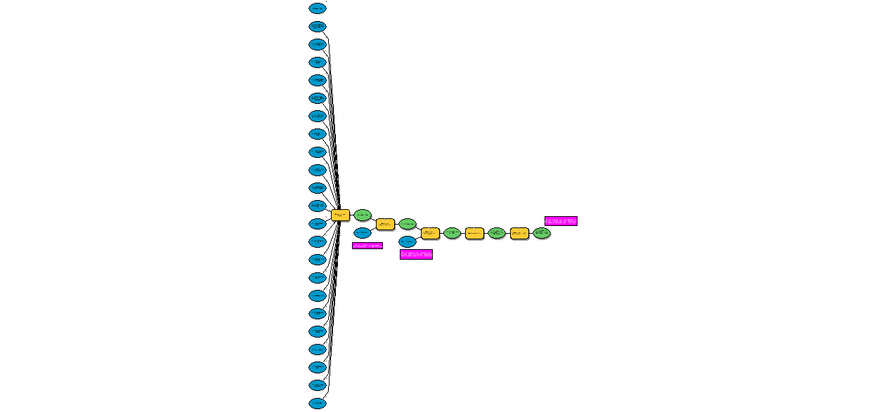
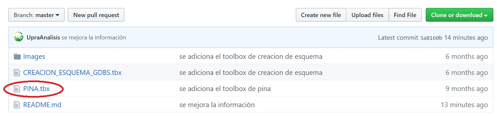
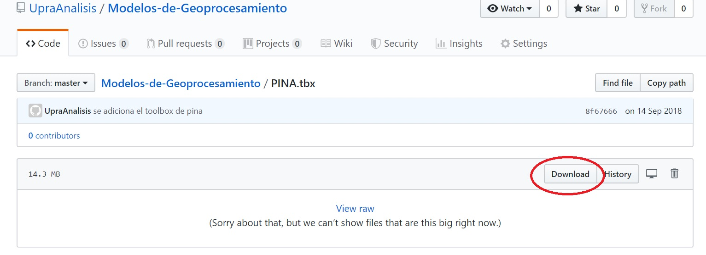
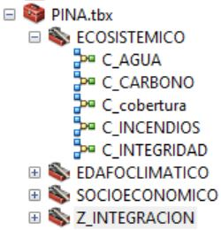

# Modelos de zonificación de aptitud

Los modelos de zonificación de aptitud son herramientas de análisis espacial que permiten identificar y delimitar las áreas con aptitud para los diferentes cultivos evaluados por la UPRA, a 
escala 1:100.000, como base para el desarrollo técnico, ambiental y competitivo de esta actividad. Las Zonificaciónes, consideran acercamientos 
metodológicos e información proveniente de diferentes entidades, incorporando los componentes físicos, sociecosistémicos y socioeconómicos, 
así como los lineamientos legales y normativos que inciden en la delimitación de áreas con aptitud para las diferentes plantaciones.

Para más información sobre la metodología, por favor consulte la información de [Zonificación](https://www.upra.gov.co/web/guest/uso-y-adecuacion-de-tierras/evaluacion-de-tierras/zonificacion)

Estos modelos de procesamiento de información geospacial **hacen uso de scripts de geoprocesamiento optimizados de python**. Los cuales fueron desarrollados por la UPRA con el propósito de **agilizar los procesos de análisis realizados por la entidad**.

**NOTA:** Se recomienda visitar la información del repositorio de [Herramientas_Optimizadas](https://github.com/UpraAnalisis/Herramientas_Optimizadas) antes de hacer uso de los modelos de geoprocesamiento.

# Versionamiento
Estos modelos de análisis para la obtención de variables y criterios por componente. Han sido desarrollados bajo la versión de ArcGIS Desktop 10.5.1

## Instalación

El proceso de instalación es el siguiente:

1. Descargar los scripts de geoprocesamiento optimizados de python, situando el directorio **SCRIPTS_ANALISIS** dentro de la raíz de la unidad **C:** o la raíz de otra unidad lógica según aplique.

2. Descargar el `Modelo`:

Para descargar haga clic en el modelo de su elección y posteriormente haga clic en el botón download, tal y como se muestra en la siguiente imagen para el modelo de geoprocesamiento del cultivo de piña.

3. Ir a ArcGIS y en hacer doble clic sobre el toolbox descargado. Es probable que toque esperar unos cuantos minutos mientras se redireccionan todos los modelos y los scripts de geoprocesamiento optimizados de python. 

3. Cerciórese de que no parece ninguna x sobre alguno de los modelos, y que estos se visualizan de la siguiente forma:

**Nota:** En caso de que aparezca la x sobre los modelos diríjase a la sección de solución de problemas del repositorio de [Herramientas_Optimizadas](https://github.com/UpraAnalisis/Herramientas_Optimizadas#soluci%C3%B3n-de-problemas) 

4. Configure las capas de entrada y directorios de salida para cada uno de los modelos.

5. Valide cada uno de los modelos.

7. Ejecute los modelos.

Palabras clave: zonificación, enfoque sistémico, evaluación de tierras, análisis multicriterio, competitividad.

